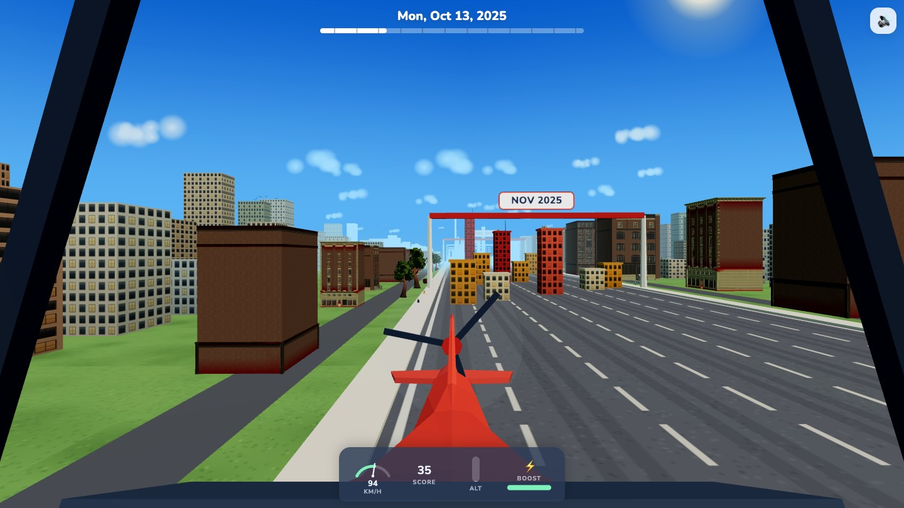
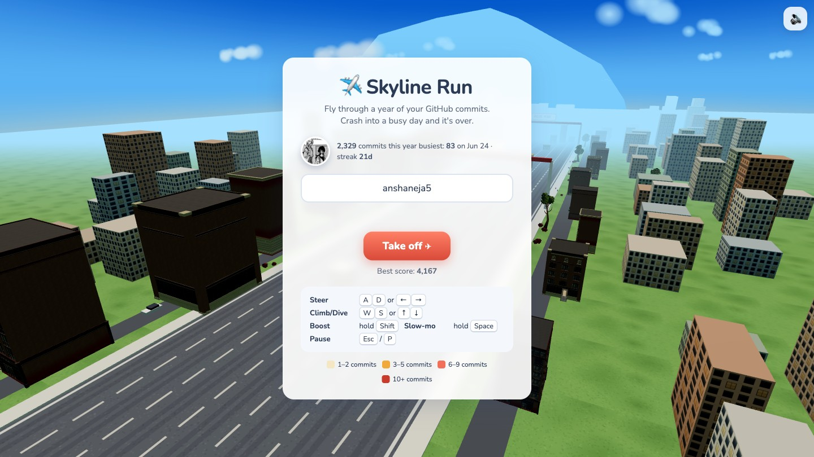

<div align="center">

# ✈️ Skyline Run

**Fly a plane through a year of your GitHub commits.**

Every day you committed becomes a building. Busy days become skyscrapers.
Crash into one and it tells you exactly which date killed you.

**[▶ Play it live](https://skyline-run.vercel.app)** · star this repo and you fly a **golden plane** ✨



</div>

---

## What is this?

Skyline Run turns your GitHub contribution graph into a 3D city and puts you in the
cockpit of a small plane flying through it — starting at your first contribution day
of the last twelve months and ending today.

- **One day = one building.** Height is exact: `2 + commits × 1.2` units. A 40-commit
  day is a tower; a lazy Sunday is a gap you can dive through.
- **Seven lanes, one per weekday.** Sunday is the leftmost lane, Saturday the
  rightmost — your weekly rhythm becomes the city's shape. Month boundaries are
  race-checkpoint arches, and a pulsing beacon marks your busiest day.
- **Crashing is informative** (and explosive). Debris, fireball, camera tumble — then
  a crash report naming the date, its commit count, and a bar chart of that week.
- **Type any GitHub username** to fly someone else's year, or share yours with a
  link that renders their city as the link preview: `skyline-run.vercel.app/share/<user>`.



## Scoring & the global leaderboard

Flying safely above the city earns **nothing**. The points live down in the canyon:

| Action | Points |
| --- | --- |
| Passing a building below rooftop level | its commit count |
| **Near-miss** (within 1.5 units of a wall or roof) | commit count × 3 |
| Chaining near-misses within 3 s | combo multiplier ×2, ×3 … up to **×8** |
| Cruising high above everything | 0 — and your combo resets |

The **global leaderboard ranks by pilot rating** — the percentage of *your own city's*
theoretical maximum you scored — so a 300-commit pilot flying brilliantly outranks a
10,000-commit pilot coasting. Submissions are validated server-side against your real
contribution data (impossible scores, speeds, and combos are rejected).

**Stargazers of this repo get a ⭐ badge on the leaderboard and fly a golden plane** —
verified automatically, no login needed.

## Controls

| Input | Action |
| --- | --- |
| `A` `D` / `←` `→` | steer, with banking roll |
| `W` `S` / `↑` `↓` | climb / dive |
| `Shift` (hold) | boost — 1.6× speed, FOV widens |
| `Space` (hold) | slow-mo — 0.45× time |
| `Esc` / `P` | pause |
| 📱 **Tilt** | roll the phone to steer, pitch it like a yoke — your holding angle at take-off becomes level flight |
| 📱 Touch | left/right half steers, top/bottom third climbs/dives, two-finger tap toggles boost |

## Running it locally

**1. Get a GitHub token** (classic, [create here](https://github.com/settings/tokens),
`read:user` scope is enough).

**2. Configure:**

```sh
cp .env.example .env   # paste your token into GITHUB_TOKEN
```

**3. Run:**

```sh
npm install
npm run dev            # Express proxy on :3001 + Vite on :5173
```

Open <http://localhost:5173>. Without a token the game runs on clearly-labeled demo
data. Without Redis the leaderboard uses a non-persistent in-memory store.

## How it's built

**Stack:** Vite + vanilla TypeScript + Three.js. No framework, no game engine.
A tiny API layer keeps the GitHub token server-side — the browser never sees it.

```
server/index.js         local dev server (Express), reuses the serverless handlers
api/
  contributions/…       GitHub GraphQL proxy, 1 h cache per user
  score.js              leaderboard submit + server-side anti-cheat validation
  leaderboard.js        top pilot ratings
  stars.js              live star count + stargazer check (golden plane)
  og/[username].js      per-user OG image: their year as a skyline (@vercel/og)
  share/[username].js   crawler-friendly share pages with per-user previews
src/game/
  world.ts              city generation, lighting, sky, traffic, pedestrians, birds
  plane.ts              cockpit, flight physics, camera feel, golden-plane skin
  explosion.ts          crash debris/fireball/smoke, pre-warmed so impact is instant
  collisions.ts         moving-cursor AABB checks (~2 buildings tested per frame)
  scoring.ts            near-miss detection and combo chain
  audio.ts              procedural Web Audio: engine, whooshes, chimes, music
  input.ts / tilt.ts    keyboard, touch zones, gyroscope steering
src/ui/                 HUD (instrument cluster), screens, leaderboard
public/assets/models    CC0 models (~6.7 MB), see CREDITS.md
```

Details that matter:

- **The data buildings are one draw call** — all ~250 towers merged into a single
  mesh with a generated window-facade texture, per-building tint, and baked AO.
  Their dimensions are data; boxes don't lie.
- **Everything else is instanced** — background blocks, trees, cars, pedestrians,
  crows. 60 fps on a mid-range laptop, with adaptive quality (pixel ratio, then
  shadows) for weaker devices.
- **Zero-asset fallback**: every model has a primitive stand-in, and all audio is
  synthesized at runtime.
- **Leaderboard storage**: Upstash Redis (sorted set of pilot ratings), with
  per-IP rate limiting and plausibility bounds computed from each user's real
  contribution data.
- `prefers-reduced-motion` disables shake, bobbing, and speed-line effects.

## Deploying your own

Deploys to Vercel as-is: static Vite build + `api/` as serverless functions.

| Env var | Purpose |
| --- | --- |
| `GITHUB_TOKEN` | classic token, `read:user` — contributions + stargazer checks |
| `DEFAULT_USER` | username pre-filled on the start screen |
| `UPSTASH_REDIS_REST_URL` / `UPSTASH_REDIS_REST_TOKEN` | leaderboard persistence (free tier at [upstash.com](https://upstash.com)) |

## Credits

All bundled 3D assets are **CC0** by [Quaternius](https://quaternius.com) — plane,
city buildings, trees, props. Full list in [CREDITS.md](CREDITS.md). Sound and music
are procedural. Level design by your commit history.

---

<div align="center">

Made by [@anshaneja5](https://github.com/anshaneja5) · follow [@vedolos](https://x.com/vedolos) on X ·
found a bug? [email me](mailto:anshanejaa@gmail.com?subject=Skyline%20Run)

**If this made you smile, [⭐ star it](https://github.com/anshaneja5/skyline-run) — you'll fly gold.**

</div>
