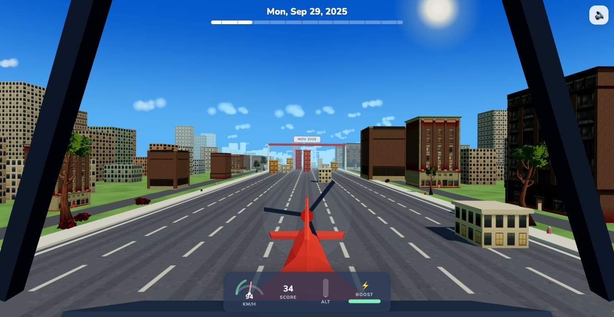

# ✈️ Skyline Run

A first-person flying game through your real GitHub contribution history. Every day
with commits becomes a building — more commits, taller building. The flight starts at
your first contribution day (12 months ago) and ends today. Crash into a building and
you'll see exactly which date and commit count killed you. Survive the whole year to win.



## How it plays

- **Cockpit view** with banking, pitch, idle bobbing, and a spinning propeller.
- **7 lanes** across the road, one per weekday (Sunday leftmost → Saturday rightmost).
- **Near-miss bonus**: pass within 1.5 units of a building for `commits × 3` points and
  chain a combo multiplier (up to x8). Flying high above the city awards nothing —
  the points live down in the canyon.
- **Boost** (Shift) and **slow-mo** (Space) share a meter that refills over time.
- A pulsing beacon marks your busiest day of the year, and the city is alive —
  pedestrians on the sidewalks, crow flocks overhead, dense blocks beyond the road.
- Month boundaries are race-checkpoint banners with a ding.
- Best score per username is stored in `localStorage`.

### Controls

| Input | Action |
| --- | --- |
| `A`/`D` or `←`/`→` | steer (with banking roll) |
| `W`/`S` or `↑`/`↓` | climb / dive |
| `Shift` (hold) | boost — 1.6× speed, FOV widens |
| `Space` (hold) | slow-mo — 0.45× time |
| `Esc` / `P` | pause |
| Tilt (phones) | roll the phone to steer, pitch it like a yoke to climb/dive — the angle you hold it at on take-off becomes level flight |
| Touch | left/right half steers, top/bottom third climbs/dives, two-finger tap toggles boost |

## Setup

1. **Create a GitHub token** (classic): <https://github.com/settings/tokens> →
   *Generate new token (classic)* → the `read:user` scope is enough.

2. **Configure the environment:**

   ```sh
   cp .env.example .env
   # edit .env and paste your token:
   # GITHUB_TOKEN=ghp_...
   # DEFAULT_USER=anshaneja5
   ```

   Without a token the backend serves clearly-labeled deterministic demo data, so the
   game still runs.

3. **Install & run:**

   ```sh
   npm install
   npm run dev
   ```

   This starts the Express proxy on `:3001` and Vite on `:5173` (which proxies `/api`).
   Open <http://localhost:5173>.

## Architecture

```
server/index.js        Express proxy — GitHub GraphQL, 1h in-memory cache per user,
                       clean 404 for unknown users, token never reaches the browser
src/
  api.ts               frontend API client
  main.ts              app flow: loading → start (cinematic orbit) → flight → crash/win
  game/
    world.ts           city generation: merged facade-textured towers (one draw call),
                       road, background skyline, banners, clouds, trees, lighting
    plane.ts           cockpit, flight physics, camera feel (FOV, shake, bobbing)
    collisions.ts      moving-cursor AABB checks (~2 buildings tested per frame)
    scoring.ts         near-miss detection, combo chain, score
    audio.ts           procedural Web Audio: engine, whoosh, chimes, crash, music
    input.ts           keyboard + touch
    game.ts            game loop orchestration
    assets.ts          GLB loading with graceful procedural fallbacks
  ui/
    hud.ts             date/speed/score/progress/boost meter, score popups
    screens.ts         start, pause, crash, win, error screens
public/assets/models   CC0 models (see CREDITS.md)
```

- Buildings are data: their heights encode exact commit counts (`2 + count × 1.2`),
  so the towers are procedural geometry merged into a single mesh with a generated
  window-facade texture. Real CC0 models (Quaternius) fill in the plane, the
  background skyline, and rooftop props.
- The game runs even with zero downloaded assets — everything has a primitive fallback.
- `prefers-reduced-motion` disables camera shake and idle bobbing.

## Notes

- Contribution data is cached in memory for 1 hour per username.
- All bundled assets are CC0 — sources in [CREDITS.md](CREDITS.md).
